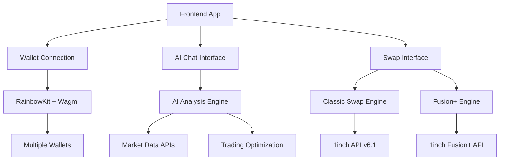

# 🚀 GenSwap - Next-Generation DeFi Trading Platform

<div align="center">


[](https://gen-swap-gilt.vercel.app)
[](LICENSE)

**Professional-grade cross-chain DeFi platform built with cutting-edge technology stack**

[🎥 Video Demo](https://www.loom.com/share/7315258044dc475ebb974fa5786773bb?sid=41f74f0c-a53a-4ff1-83e7-448e25a2af9c) • [🚀 Live App](https://gen-swap-gilt.vercel.app) • [📖 Documentation](#documentation)

</div>

## 🌟 What Makes GenSwap Special

GenSwap is a **TRUE DeFi** platform that revolutionizes cross-chain and single-chain token swapping with an innovative approach that prioritizes user security, AI-powered optimization, and seamless user experience.

### 🔐 **TRUE DeFi Architecture**
- **Zero Private Key Exposure**: Your keys never leave your wallet
- **Client-Side Signing**: All transactions signed locally in your wallet
- **Non-Custodial**: Complete control over your assets
- **Decentralized Execution**: Direct on-chain interactions

### 🤖 **AI-Powered Trading Intelligence**
- Real-time market analysis and insights
- Intelligent swap optimization recommendations
- Risk assessment and mitigation strategies
- Dynamic parameter optimization for better outcomes

## ⚡ Core Features

### 🔄 **Multi-Protocol Swap Solutions**

| Feature | Fusion Intent (Cross-Chain) | Classic Swap (Single-Chain) |
|---------|----------------------------|------------------------------|
| **Type** | Cross-chain transfers | Same-chain optimized swaps |
| **Speed** | Intent-based execution | Instant execution |
| **Use Case** | Multi-chain portfolio management | Fast intra-chain trading |
| **AI Enhancement** | Route optimization | Price impact minimization |

### 🎯 **Advanced Trading Features**
- **Smart Route Optimization**: AI-powered route selection for best prices
- **MEV Protection**: Advanced protection against front-running
- **Gas Optimization**: Dynamic gas fee optimization
- **Slippage Management**: Intelligent slippage tolerance adjustment
- **Real-time Analytics**: Comprehensive trading insights

### 🧠 **AI Chat Interface**
- Natural language trading queries
- Market analysis and insights
- Strategy recommendations
- Real-time portfolio analysis

## 🛠 Technology Stack

### **Frontend**
```typescript
React 18 + TypeScript + Vite
├── UI Framework: Radix UI + Tailwind CSS + shadcn/ui
├── Web3 Integration: Wagmi + RainbowKit + Viem
├── State Management: React Query + Zustand
├── Wallet Support: MetaMask, WalletConnect, Coinbase Wallet
└── Cross-Chain: 1inch Cross-Chain SDK
```

### **Backend Architecture**
```javascript
Node.js + Express
├── Fusion+ Implementation: Cross-chain intent processing
├── Classic Swap Engine: Single-chain swap optimization
├── AI Analysis Engine: Machine learning trade optimization
├── Data APIs: Real-time market data aggregation
└── Security Layer: Transaction validation & monitoring
```

### **Integrations**
- **1inch Protocol**: DEX aggregation and routing
- **1inch Fusion+**: Advanced cross-chain capabilities
- **Multiple RPCs**: Redundant network connections
- **Real-time Data**: Live price feeds and market data

## 🚀 Quick Start

### Prerequisites
- Node.js 18+ and pnpm
- Ethereum wallet (MetaMask recommended)
- 1inch API key for backend services

### Frontend Setup
```bash
# Clone the repository
git clone https://github.com/aliveevie/gen-swap.git
cd gen-swap

# Install dependencies
pnpm install

# Start development server
pnpm dev
```

### Backend Setup
```bash
# Navigate to backend
cd backend-fusion-plus

# Install backend dependencies
pnpm install

# Configure environment
cp .env.example .env
# Add your 1inch API key and RPC URLs

# Start backend server
node server.js
```

### Server Functions Setup
```bash
# Navigate to server directory
cd server

# Install server dependencies
npm install

# Configure environment
cp env.example .env

# Start server functions
npm start
```

## 📚 Implementation Guides

### 🔗 **Integration Documentation**

#### **Fusion+ Cross-Chain Implementation**
- [📋 Fusion+ Integration Guide](https://github.com/aliveevie/gen-swap/pull/2)
- Complete cross-chain swap solution with intent-based execution
- Advanced order management and tracking
- Multi-chain asset management

#### **Data APIs Integration** 
- [📋 Data APIs Implementation](https://github.com/aliveevie/gen-swap/pull/1)
- Real-time market data aggregation
- Price feed optimization
- Historical data analysis

#### **Classic Swap Engine**
- [📋 Classic Swap Integration](https://github.com/aliveevie/gen-swap/pull/3)
- High-performance single-chain swaps
- Gas optimization algorithms
- AI-powered execution strategies

## 🏗 Architecture Overview



## 📊 Project Structure

```
gen-swap/
├── 🎨 Frontend (React + TypeScript)
│   ├── src/components/     # UI components
│   ├── src/hooks/         # Custom React hooks
│   ├── src/lib/           # Utilities and helpers
│   └── src/types/         # TypeScript definitions
│
├── ⚙️ Backend (Node.js + Express)
│   ├── backend-fusion-plus/   # Main backend server
│   ├── server/               # Additional server functions
│   └── fusion-plus-order/    # Order management service
│
└── 📖 Documentation
    ├── Implementation guides
    ├── API documentation
    └── Setup instructions
```

## 🎯 Key Differentiators

### **Security First**
- Non-custodial architecture with client-side transaction signing
- Comprehensive input validation and sanitization
- Real-time transaction monitoring and verification
- Advanced error handling and recovery mechanisms

### **AI-Enhanced Trading**
- Machine learning algorithms for trade optimization
- Real-time market sentiment analysis
- Predictive analytics for price movements
- Personalized trading recommendations

### **Developer Experience**
- Comprehensive TypeScript support
- Extensive testing suite
- Detailed API documentation
- Modular and extensible architecture

## 🔧 Development

### **Testing**
```bash
# Run frontend tests
pnpm test

# Test backend functionality
cd backend-fusion-plus && node test-classic-swap.js

# Test server functions
cd server && npm test
```

### **Building for Production**
```bash
# Build frontend
pnpm build

# Optimize backend
cd backend-fusion-plus && npm run optimize

# Deploy to Vercel
vercel --prod
```

## 🌐 Live Deployment

- **Production App**: [https://gen-swap-gilt.vercel.app](https://gen-swap-gilt.vercel.app)
- **Staging Environment**: Available for testing new features
- **CI/CD Pipeline**: Automated testing and deployment via Vercel

## 🤝 Contributing

We welcome contributions! Please see our [Contributing Guidelines](CONTRIBUTING.md) for details on:
- Code standards and best practices
- Pull request process
- Issue reporting guidelines
- Development setup

## 📄 License

This project is licensed under the MIT License - see the [LICENSE](LICENSE) file for details.

## 🔗 Links

- **🏠 Website**: [GenSwap Live Demo](https://gen-swap-gilt.vercel.app)
- **📹 Demo Video**: [Watch on Loom](https://www.loom.com/share/7315258044dc475ebb974fa5786773bb)
- **🔗 Repository**: [GitHub](https://github.com/aliveevie/gen-swap)
- **📧 Contact**: [Open an Issue](https://github.com/aliveevie/gen-swap/issues)

---

<div align="center">

**Built with ❤️ by the GenSwap Team**

*Empowering the future of decentralized finance*

</div>
